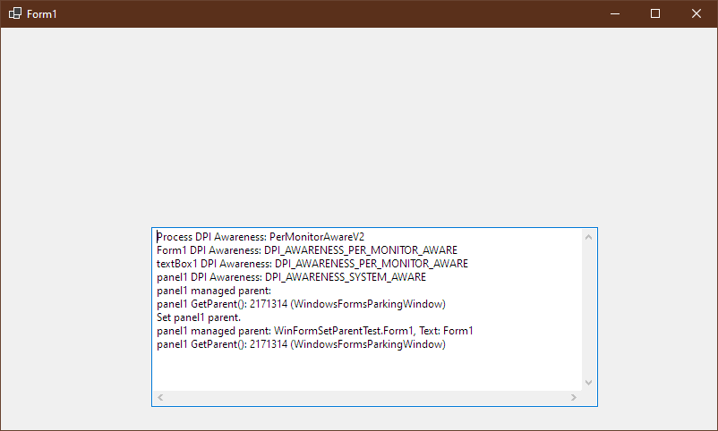
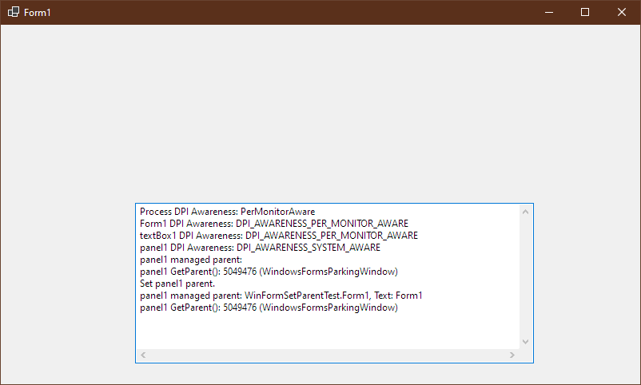
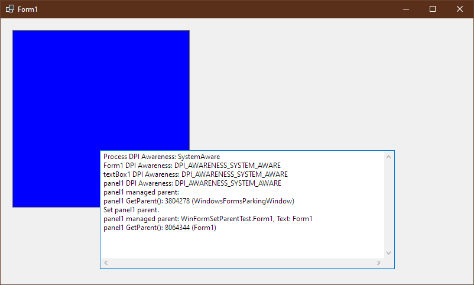
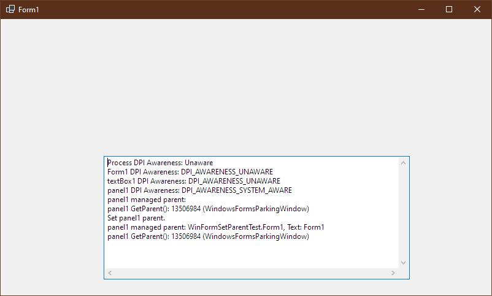

# WinFormSetParentTest

This is to test the behavior of `ControlCollection.Add`  when the parent and child control has the different DPI awareness context. This application attempts to add a `Panel` named `panel1` with a constant `SystemAware` DPI awareness context to a `Form` with various DPI awareness contexts.

This is to provide a minimal repro for dotnet/winforms#2163, where failures to call `SetParent` WinAPI does not throw any `Exception`, but fails silently, leaving inconsistent states between WinForm and native environment.

Replace the following statement in `Program.cs` to try the application in different DPI awareness contexts.

```c#
Application.SetHighDpiMode(HighDpiMode.PerMonitorV2);
```

### HighDpiMode.PerMonitorV2

Fails silently.



### HighDpiMode.PerMonitor

Fails silently.



### HighDpiMode.SystemAware

Succeeds.



### HighDpiMode.DpiUnaware

Fails silently.



